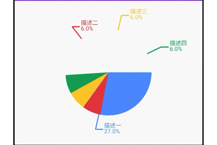
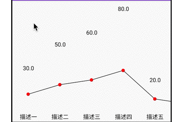

本项目的配套博客，详细见于掘金[Android 自定义View篇](https://juejin.im/collection/5e7ca08fe51d45364b888317)

# 包导入
```xml
// 1. root -> build.gradle
allprojects {
	repositories {
			
		maven { url 'https://jitpack.io' }
	}
}
// 2. app -> build.gradle
dependencies {
	implementation 'com.github.ClericYi:View_How_To_Make_It:-SNAPSHOT'
}
```
# 饼图的使用

```kotlin
private fun initPieDatas() {
        val pieBean1 = PieBean().setArcColor(blueColor).setRatio(4f).setDescription("描述一")
        val pieBean2 = PieBean().setArcColor(redColor).setRatio(1f).setDescription("描述二")
        val pieBean3 = PieBean().setArcColor(yellowColor).setRatio(1f).setDescription("描述三")
        val pieBean4 = PieBean().setArcColor(greenColor).setRatio(1f).setDescription("描述四")
        val pieBeans: MutableList<PieBean> = ArrayList()
        pieBeans.add(pieBean1)
        pieBeans.add(pieBean2)
        pieBeans.add(pieBean3)
        pieBeans.add(pieBean4)

        pie.setData(pieBeans)
    }
```

# 柱状图的使用

```kotlin
private fun initBarDatas() {
        val barBean0 = BarBean().setValue(30f).setDescription("描述一")
        val barBean1 = BarBean().setValue(50f).setDescription("描述二")
        val barBean2 = BarBean().setValue(60f).setDescription("描述三")
        val barBean3 = BarBean().setValue(80f).setDescription("描述四")
        val barBean4 = BarBean().setValue(20f).setDescription("描述五")
        val barBean5 = BarBean().setValue(10f).setDescription("描述六")
        val barBeans: MutableList<BarBean> = ArrayList()
        barBeans.add(barBean0)
        barBeans.add(barBean1)
        barBeans.add(barBean2)
        barBeans.add(barBean3)
        barBeans.add(barBean4)
        barBeans.add(barBean5)

        bar.setData(barBeans)
    }
```

# 折线图的使用

```kotlin
private fun initLineDatas() {
        val lineBean0 = LineBean().setValue(30f).setDescription("描述一")
        val lineBean1 = LineBean().setValue(50f).setDescription("描述二")
        val lineBean2 = LineBean().setValue(60f).setDescription("描述三")
        val lineBean3 = LineBean().setValue(80f).setDescription("描述四")
        val lineBean4 = LineBean().setValue(20f).setDescription("描述五")
        val lineBean5 = LineBean().setValue(10f).setDescription("描述留")
        val lineBeans: MutableList<LineBean> = ArrayList()
        lineBeans.add(lineBean0)
        lineBeans.add(lineBean1)
        lineBeans.add(lineBean2)
        lineBeans.add(lineBean3)
        lineBeans.add(lineBean4)
        lineBeans.add(lineBean5)

        line.setData(lineBeans)
    }
```